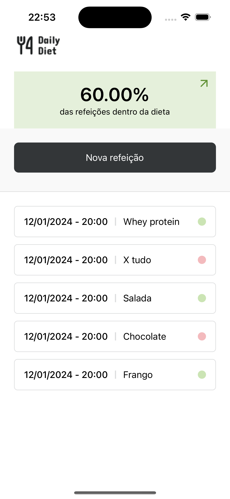

# Nome do aplicativo: Calculadora

## Descrição do aplicativo

O "Daily Diet" é um app que ajuda você a controlar suas refeições diárias. Com ele, você pode registrar o que come e acompanhar seu plano alimentar de forma fácil e prática.

## Objetivo do aplicativo

O objetivo do "Daily Diet" é ajudar as pessoas a monitorar e melhorar sua alimentação diária, facilitando o controle das refeições e ajudando a manter uma dieta equilibrada.

## Funcionalidades do aplicativo

- Cadastrar refeição
- Histórico de refeições
- Excluir refeição
- Estatísticas das refeições na dieta

## Instruções de uso

Para utilizar o app, basta adicionar sua refeição clicando no botão "adicionar refeição" e preencher o formulário com as informações. Depois, é possível visualizar o histórico, podendo deletar a refeição, além de visualizar suas estatísticas a fim de manter o controle da dieta.

# Instruções de instalação

1. Clone o repositório
2. Instale as dependências com `npm install --force`
3. Execute o aplicativo com `npm start`
4. Acesse o aplicativo no qr code gerado

## Vídeos de demonstração

[Link para o vídeo de demonstração](./assets/video.mp4)

## Imagens do aplicativo

## Desenvolvedores e suas funções
- Arthur: Tela Home
- Igor: Tela estatísticas
- Felipe: Tela Home
- Juan: Tela de cadastro da refeição
- Nicolas: Tela de cadastro refeição
- Pedro: Tela detalhes refeição e ajustes
